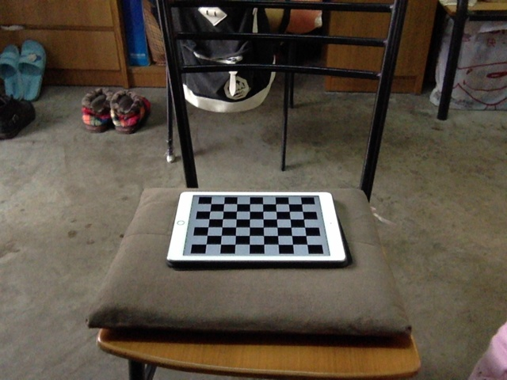

#摄像机标定与俯瞰视角变换

#### 摄像机标定及俯瞰视角变换

> 1. Camera calibration
> 2. Bird's-eye view transformation
## 一、开发软件说明
### 开发环境
- Ubuntu 14.04
- cmake 2.8.12.2
- opencv 3.0

### 运行方式
- build project `make all`
- run `./camera 8 6 5 3`

## 二、算法具体步骤
#### 2.1 通过摄像头获取适合计算的图像
- 每隔一段时间取当前一帧
- 通过cvFindeCornerSubPix函数寻找图像中的棋盘
- 如果棋盘符合输入参数条件的话，保持该棋盘数据

#### 2.2 计算相机内参数矩阵和变形矩阵
- cvCalibrateCamera2函数计算相机内参数矩阵和变形矩阵
	
#### 2.3 矫正后的摄像头
- 将摄像头的每一帧图像矫正后输出
- 需要用到cvInitUndistortMap与cvRemap函数

#### 2.4 获取一张棋盘在水平面上的图
- 通过摄像头获取一张棋盘在水平面上的图

#### 2.5 生成鸟瞰图
- 需要用到cvWarpPerspective函数

## 三、算法实现要点
#### 3.1 通过摄像头获取适合计算的图像

#### 3.2 计算相机内参数矩阵和变形矩阵
	

#### 3.3 矫正后的摄像头

#### 3.4 获取一张棋盘在水平面上的图

#### 3.5 生成鸟瞰图

## 四、实验结果展示及分析
#### 4.1 通过摄像头获取适合计算的图像

#### 4.2 矫正后的摄像头

#### 4.3 获取一张棋盘在水平面上的图

#### 4.4 生成鸟瞰图

